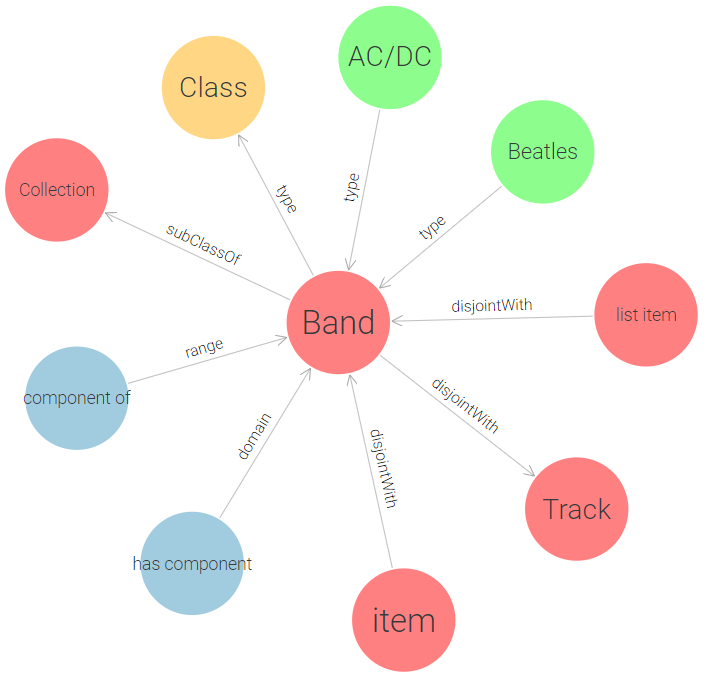
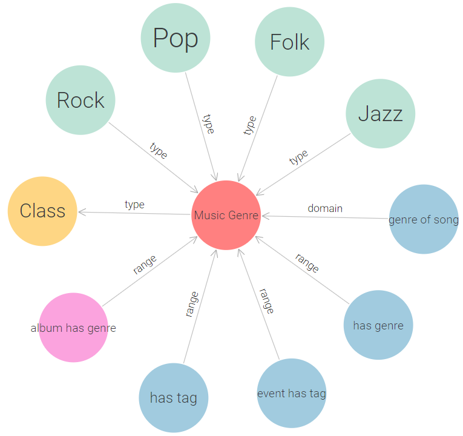
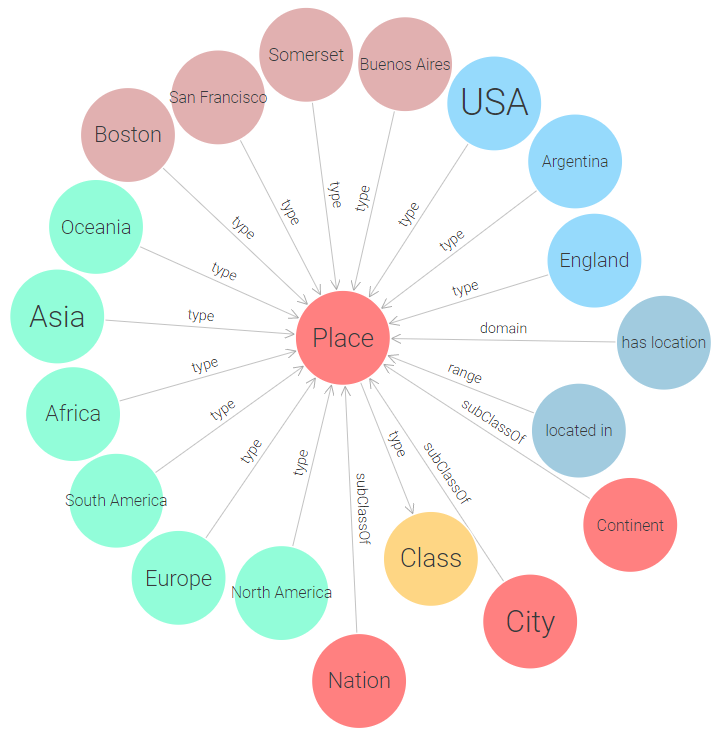

# music-events-ontology
Music ontology focused on musical events modeling.

## Class Relationships


## Class Graphs










## Streamlit Web Client
The web client implements an interaction flow useful for consulting the ontology.

### SPARQL
The connection and the extrapolation of information from the ontology is done through a set of SPARQL queries. You can find them in `res/queries.json`.

An example (parameterized query):
```
SELECT ?Song ?Genre ?Performed_By 
WHERE {{ 
    ?EventItem a music:Event. 
    ?EventItem music:hasPerformance ?PerformanceItem. 
    ?PerformanceItem music:hasSongPerformed ?SongItem. 
    ?SongItem music:hasGenre ?Genre. 
    ?SongItem music:writtenBy ?Performed_ByItem. 
    ?Performed_ByItem music:hostOf ?EventItem. 
    ?EventItem rdfs:label ?EventLabel. 
    ?SongItem rdfs:label ?Song. 
    ?Performed_ByItem rdfs:label ?Performed_By. 
    FILTER(REGEX(?EventLabel, '^{}*', 'i') && LANG(?EventLabel) = "en" && LANG(?Song) = "en" && LANG(?Performed_By) = "en")
}} 
ORDER BY ?PerformanceItem
```